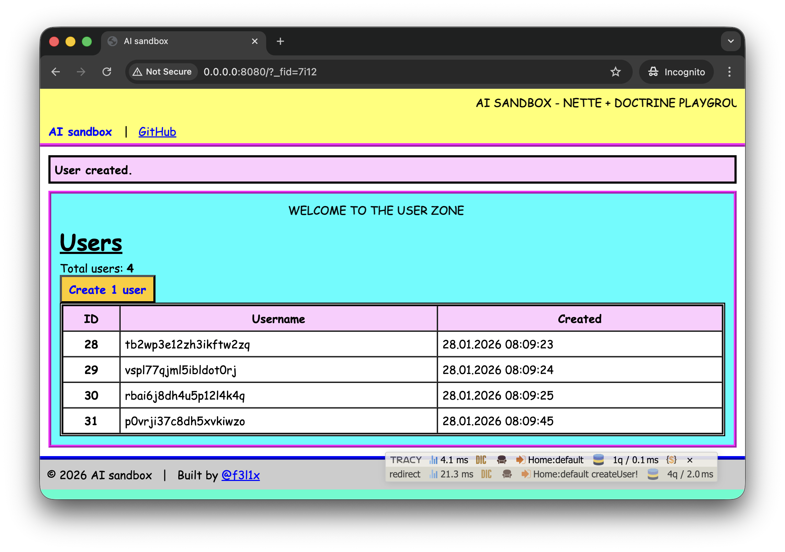
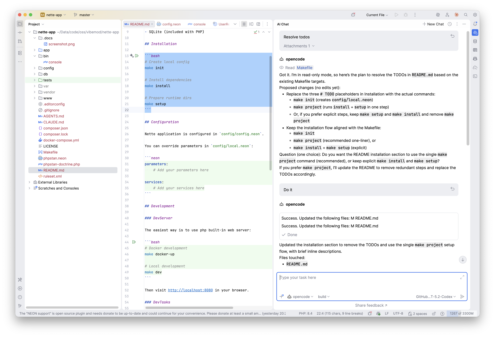

# Nette App

Modern PHP backend API using Nette framework with Doctrine ORM and SQLite database.

## Prerequisites

- PHP 8.4 or higher
- Composer
- SQLite (included with PHP)

## Installation

```bash
# Create local config
make init

# Install dependencies
make install

# Prepare runtime dirs
make setup
```

## Configuration

Nette application is configured in `config/config.neon`.

You can override parameters in `config/local.neon`:

```neon
parameters:
    # Add your parameters here

services:
    # Add your services here
```

## Development

### DevServer

The easiest way is to use php built-in web server:

```bash
# Docker development
make docker-up

# Local development
make dev
```

Then visit http://localhost:8080 in your browser.

### DevTasks

```bash
# Quality assurance (coding standards + static analysis)
make qa

# Run coding standards check
make cs

# Fix coding standards automatically
make csf

# Run static analysis with PHPStan
make phpstan

# Run test suite
make tests

# Run with coverage report
make coverage

# Start Docker environment
make docker-up

# Access Docker container
make docker-in

# Clean cache and logs
make clean
```

## Demo

### Homepage


### Phpstorm + Opencode


## Resources

- [Nette Framework](https://nette.org)
- [Doctrine ORM](https://www.doctrine-project.org)
- [Nette Documentation](https://doc.nette.org)
